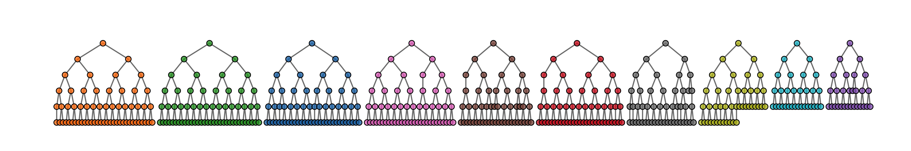

# The `sspse` package

This is an R package to implement successive sampling population size estimation (SS-PSE).

SS-PSE is used to estimate the size of hidden populations using respondent-driven sampling (RDS) data. The package can implement SS-PSE, visibility SS-PSE, and capture-recapture SS-PSE. 

The package was developed by the [Hard-to-Reach Population Methods Research Group (HPMRG)](https://github.com/HPMRG).



# Installation

The package is available on CRAN and can be installed using

```{r}
install.packages("sspse")
```

To install the latest development version from github, the best way it to use git to create a local copy and install it as usual from there. If you just want to install it, you can also use:

```{r}
# If devtools is not installed:
# install.packages("devtools")

devtools::install_github("HPMRG/sspse")
```

# Implementation

Load package and example data

```
library(sspse)
data(fauxmadrona)
```

`fauxmadrona` is a simulated RDS data set with no seed dependency, which is used to demonstrate RDS estimators. It has the format of an `rds.data.frame` and is a sample of size 500 with 10 seeds and 2 coupons from a population of size 1000. For the purpose of this example, we will assume the population size is unknown and our goal is to estimate it.

We can make a quick visualization of the recruitment chains, where the size of the node is proportional to the reported degree and the color represents separate chains.

```{r}
reingold.tilford.plot(fauxmadrona, 
                      vertex.label=NA, 
                      vertex.size="degree",
                      show.legend=FALSE,
                      vertex.color="seed")
```

## The `posteriorsize()` function

The function that will perform both the original and visibility variants of SS-PSE is called `posteriorsize()`. It requires some prior knowledge about the population size, $N$, which is usually expressed using the `median.prior.size=` argument. 

Although there are many options within the `posteriorsize` function, most can be left at their default values unless you have a specific reason to believe they should be set differently.

## Original SS-PSE example

Set `visibility=FALSE`. By default, 1000 samples will be drawn from the posterior distribution for $N$ using a burnin of 1000 and an interval of 10. This may take a few seconds to run.

```
fit1 <- posteriorsize(fauxmadrona, 
              median.prior.size=1000,
              visibility=FALSE)
```

Plot the posterior distribution for $N$.

```
plot(fit1, type="N")
```

Create a table summary for the prior and posterior distributions for population size, specifying that we are interested in a 90% credible interval for $N$.

```
summary(fit1, HPD.level = 0.9)
```

## Visibility SS-PSE example

Set `visibility=TRUE`. Because of the measurement error model, this model will take a little longer to fit - perhaps a minute or so.

```
fit2 <- posteriorsize(fauxmadrona, 
              median.prior.size=1000,
              visibility=TRUE)
```

Plot the posterior distribution for $N$.

```
plot(fit2, type="N")
```

Create a table summary for the prior and posterior distributions for population size, specifying that we are interested in a 90% credible interval for $N$.

```
summary(fit2, HPD.level = 0.9)
```

# Resources

Please use the GitHub repository to report bugs or request features: https://https://github.com/HPMRG/sspse

<!-- A more detailed vignette with information on measurement error and diagnostics can be found here: [[link to katie's page]] -->

See the following papers for more information and examples:

#### Statistical Methodology

* Handcock, Mark S., Gile, Krista J. and Mar, Corinne M. (2014) [Estimating Hidden Population Size using Respondent-Driven Sampling Data](https://doi.org/10.1214/14-ejs923), *Electronic Journal of Statistics*, 8(1):1491-1521.
* Handcock, Mark S., Gile, Krista J. and Mar, Corinne M. (2015) [Estimating the Size of Populations at High Risk for HIV using Respondent-Driven Sampling Data](https://doi.org/10.1111/biom.12255), *Biometrics*, 71(1):258-266.
* Kim, Brian J. and Handcock, Mark S. (2021) [Population Size Estimation Using Multiple Respondent-Driven Sampling Surveys](https://doi.org/10.1093/jssam/smz055), *Journal of Survey Statistics and Methodology*, 9(1):94–120.

#### Applications

* Johnston, Lisa G., McLaughlin, Katherine R., El Rhilani, Houssine, Latifi, Amina, Toufik, Abdalla, Bennani, Aziza, Alami, Kamal, Elomari, Boutaina, and Handcock, Mark S. (2015) [Estimating the Size of Hidden Populations Using Respondent-driven Sampling Data: Case Examples from Morocco](https://doi.org/10.1097/EDE.0000000000000362), *Epidemiology*, 26(6):846-852.
* Johnston, Lisa G., McLaughlin, Katherine R., Rouhani, Shada A., and Bartels, Susan A. (2017) [Measuring a Hidden Population: A Novel Technique to Estimate the Population Size of Women with Sexual Violence-Related Pregnancies in South Kivu Province, Democratic Republic of Congo](https://doi.org/10.1016/j.jegh.2016.08.003), *Journal of Epidemiology and Global Health*, 7(1):45-53.
* McLaughlin, Katherine R., Johnston, Lisa G., Gamble, Laura J., Grigoryan, Trdat, Papoyan, Arshak, and Grigoryan, Samvel (2019) [Population Size Estimations Among Hidden Populations Using Respondent-Driven Sampling Surveys: Case Studies From Armenia](https://doi.org/10.2196/12034), *JMIR Public Health and Surveillance*, 5(1):e12034.
* Johnston, Lisa G., McLaughlin, Katherine R., Gios, Lorenzo, Cordioli, Maddalena, Staneková, Danica V.,Blondeel, Karel, Toskin, Igor, Mirandola, Massimo, and The SIALON II Network (2021) [Populations size estimations using SS-PSE among MSM in four European cities: how many MSM are living with HIV?](https://doi.org/10.1093/eurpub/ckab148), *European Journal of Public Health*, 31(6):1129–1136.
